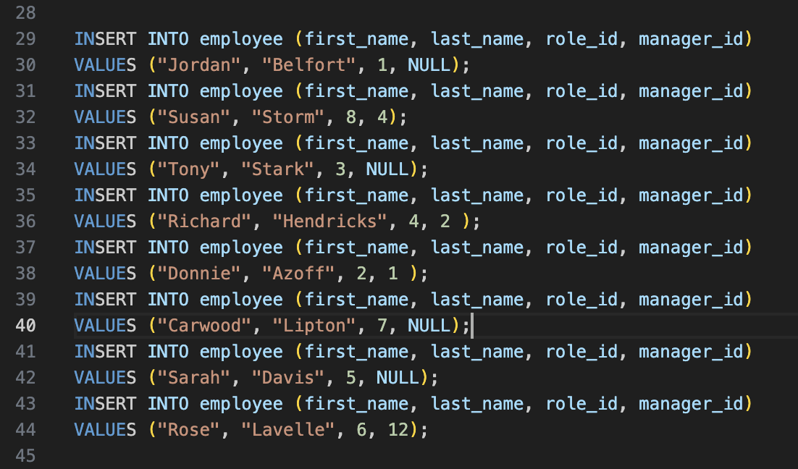

# Employee Tracker

    ## Table of Contents

- - [Demo Link](#demo-link)

- - [Description](#Description)

- - [Installation](#Installation)

- - [Usage](#Usage)

- - [Questions](#Questions)

- - [Contributors](#Contributors)

- - [Testing](#Testing)

- - [License](#License)

    ## Demo Link

    [Demo Link](https://drive.google.com/file/d/1hmdwT0VheBbNpdY2DTz6oj4IR9cl_1ds/view)

    

    [GitHub Repo](https://github.com/derekmeduri/Employee-Tracker)

    ## Screenshots

    

    

    

    

    ## Description

    Using CLI to track employee databases. The client should be able to view all employees, departments and roles. The client should also be able to add/update employees, add departments and add roles.

    ## Installation

    Nodejs, Inquirer 8.2.4, MySQL2, and Console.Table are all required to run this command-line application .User should run "npm install" in the command-line to make sure all dependencies are installed. Then user can run "node index.js" in the command terminal to launch application.

    ## Usage

    personal use only.

    ## Questions

    Please reach out if you have any questions regarding this application.

    - Name - Derek Meduri
    - Email - derekmeduri@gmail.com
    - GitHub - [derekmeduri](https://github.com/derekmeduri/)

    ## Contributors

    n/a

    ## Testing

    n/a

    ## License

    Licensed under MIT License.
